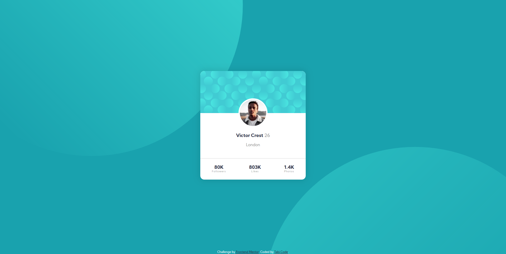

# Frontend Mentor - Profile card component solution

This is a solution to the [Profile card component challenge on Frontend Mentor](https://www.frontendmentor.io/challenges/profile-card-component-cfArpWshJ). Frontend Mentor challenges help you improve your coding skills by building realistic projects. 

## Table of contents

- [Overview](#overview)
  - [The challenge](#the-challenge)
  - [Screenshot](#screenshot)
  - [Links](#links)
- [My process](#my-process)
  - [Built with](#built-with)
  - [What I learned](#what-i-learned)
  - [Continued development](#continued-development)
  - [Useful resources](#useful-resources)
- [Author](#author)

## Overview

### The challenge

- Build out the project to the designs provided
- Build profile card

### Screenshot

### Links

- Solution URL: [Add solution URL here](https://your-solution-url.com)
- Live Site URL: [Add live site URL here](https://your-live-site-url.com)

## My process

### Built with

- Semantic HTML5 markup
- CSS custom properties
- SASS
- Flexbox

### What I learned

This project helped me with shaping my knowledge about Git and Sass. It was a great project for my first challenge!

Very simple and easy to code. A little bit of a problem for me was positioning background images.

### Continued development

I found out that Flexbox and Grid are very powerful tools, which I wanna focus on even in future challenges.

### Useful resources

- [Sass documentation](https://sass-lang.com/documentation) - This helped me with basic Sass
- [Watch Sass tutorial](https://sassbreak.com/watch-your-sass/) - Amazing tutorial where is very simply described how to watch Sass file
- [GitHub documentation](https://cli.github.com/manual/) - This documentation helped me with setting up the repository and upload files to repo from CLI

## Author

- Frontend Mentor - [@Tabinka](https://www.frontendmentor.io/profile/Tabinka)
- Twitter - [@alttabik](https://www.twitter.com/alttabik)
